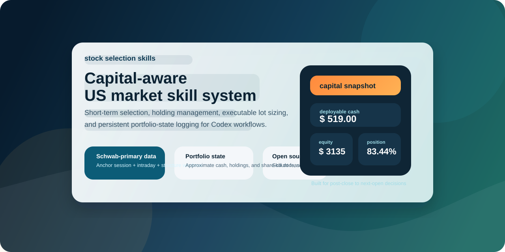
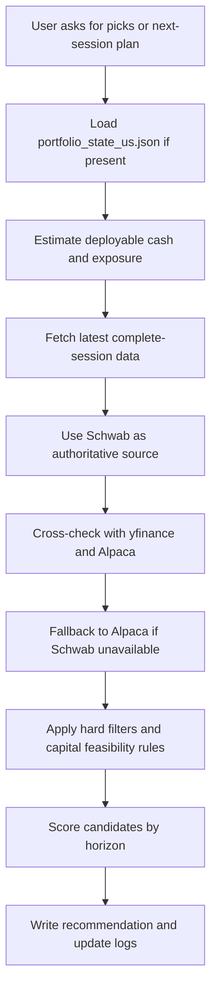

<div align="center">



# stock selection skills

Capital-aware US equities and ETF selection skill for Codex.

Built for the post-close to next-open window, with executable sizing checks, structure-based plans, and persistent portfolio-state logging.

<p>
  
  
  
  
  
</p>

<p>
  <a href="https://github.com/3109406559-code/stock-selection-skills">Repository</a> •
  <a href="./SKILL.md">Skill Spec</a> •
  <a href="./references/us-env-contract.md">Env Contract</a> •
  <a href="./scripts/smoke_test.py">Smoke Test</a>
</p>

</div>

## Snapshot

| Area | What it gives you |
|---|---|
| Selection | Short-term, medium-term, and long-term US workflows in one skill |
| Execution | Capital-aware share-count feasibility checks before presenting executable entries |
| Tracking | Persistent `stock_logs/portfolio_state_us.json` for approximate cash, holdings, and exposure |
| Data | Schwab-authoritative market data with yfinance and Alpaca cross-checks |
| Fallback | Deterministic source downgrade to Alpaca when Schwab is unavailable |
| Validation | Deterministic smoke tests and CI validation |

## Why This Repo Exists

Most stock-picking prompts stop at "what looks strong." This skill pushes further:

- checks whether user can actually afford the proposed entry size
- tracks approximate cash and holdings between conversations
- handles existing-position management before opening new trades
- uses script-backed workflows instead of prompt memory only

## How It Works



## Repository Layout

```text
stock-selection-skills/
|- SKILL.md
|- agents/
|  |- openai.yaml
|- references/
|  |- capital-and-position-management.md
|  |- data-sources-and-window.md
|  |- horizon-selection-framework.md
|  |- output-template.md
|  |- price-plan-rules.md
|  |- short-term-backtest-workflow.md
|  |- trading-window-and-calendar.md
|  |- universe-and-risk-filters.md
|  |- us-env-contract.md
|  |- us-migration-runbook.md
|  |- us-validation-matrix.md
|- scripts/
|  |- fetch_us_market_data.py
|  |- us_market_data.py
|  |- portfolio_state_us.py
|  |- backtest_short_term_rule_us.py
|  |- smoke_test.py
|  |- requirements.txt
|- .github/
|  |- workflows/
|     |- ci.yml
|- LICENSE
`- README.md
```

## Quick Start

### 1. Install as a Codex skill

Copy this repository into your Codex skills directory as `us-stock-picker`:

```powershell
$dst = "$HOME\\.codex\\skills\\us-stock-picker"
if (Test-Path $dst) { Remove-Item -Recurse -Force $dst }
Copy-Item -Recurse -Force . $dst
```

After install, trigger it in Codex with:

```text
$us-stock-picker
```

### 2. Install dependencies

For local repo mode:

```powershell
python -m venv .venv
.venv\Scripts\python.exe -m pip install -r scripts\requirements.txt
```

For installed-skill mode:

```powershell
python -m venv "$HOME\.codex\skills\us-stock-picker\.venv"
"$HOME\.codex\skills\us-stock-picker\.venv\Scripts\python.exe" -m pip install -r "$HOME\.codex\skills\us-stock-picker\scripts\requirements.txt"
```

### 3. Configure credentials

Set required env vars from `references/us-env-contract.md`.

### 4. Run deterministic smoke test

Repo mode:

```powershell
.venv\Scripts\python.exe scripts\smoke_test.py
```

Installed-skill mode:

```powershell
"$HOME\.codex\skills\us-stock-picker\.venv\Scripts\python.exe" "$HOME\.codex\skills\us-stock-picker\scripts\smoke_test.py"
```

### 5. Fetch one symbol

Repo mode:

```powershell
.venv\Scripts\python.exe scripts\fetch_us_market_data.py AAPL --days 120 --include-intraday --pretty
```

Installed-skill mode:

```powershell
"$HOME\.codex\skills\us-stock-picker\.venv\Scripts\python.exe" "$HOME\.codex\skills\us-stock-picker\scripts\fetch_us_market_data.py" AAPL --days 120 --include-intraday --pretty
```

### 6. Initialize and update portfolio state

```powershell
.venv\Scripts\python.exe scripts\portfolio_state_us.py init --cash 10000 --as-of-date 2026-04-13 --overwrite
.venv\Scripts\python.exe scripts\portfolio_state_us.py buy AAPL --price 200 --budget 1000 --date 2026-04-13 --estimated
.venv\Scripts\python.exe scripts\portfolio_state_us.py show
```

### 7. Run short-term rule backtest

```powershell
.venv\Scripts\python.exe scripts\backtest_short_term_rule_us.py AAPL --start-date 20250101 --end-date 20260410 --source auto --pretty
```
## Typical Use Cases

| Scenario | What the skill does |
|---|---|
| "I only have $3,000" | Filters out non-executable entry plans and sizes recommendations |
| "I already hold AAPL" | Prioritizes position management before suggesting new entries |
| "Pick 3 short-term names" | Scores short-term candidates from latest complete-session context |
| "Write this into the log" | Updates portfolio state and log records |

## Validation

This repository includes:

- deterministic smoke tests via `scripts/smoke_test.py`
- deterministic CI validation for core source-selection and portfolio math
- script compilation checks in GitHub Actions

## Disclaimer

This repository is for workflow automation and research support. It is not investment advice, not broker execution logic, and not a guarantee of performance or tradability.

