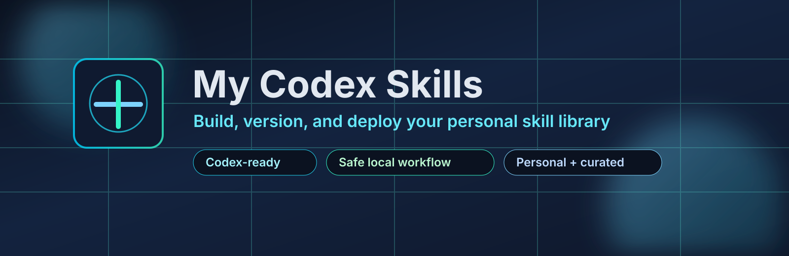

  

<h1 align="center">My Codex Skills</h1>

  <strong>Your personal skill forge for Codex: build fast, deploy safely, keep full control.</strong>

  
  
  
  

This repository is the source of truth for your personal Codex skills. It keeps your custom workflows versioned, testable, and deployable without modifying core shipped skills.

## Why This Repo

- Keep custom skills isolated from Codex core/system skills.
- Build and iterate quickly with a repeatable structure.
- Deploy only the skills you approve into `C:\Users\{user}\.codex\skills`.
- Track every skill change with Git history.

## Repository Layout

| Path | Description |
| --- | --- |
| `.codex/skills/<skill-name>/SKILL.md` | Canonical skill definitions. |
| `scripts/deploy-skills.ps1` | Deploy selected or all repo skills to Codex home. |
| `templates/skill-template/SKILL.md` | Quick-start template for new skills. |
| `SKILLS_INVENTORY.md` | Current approved skill catalog for this repo. |
| `HANDOFF.md` | Operational handoff and next-step checkpoint. |

## Current Approved Skills

| Skill | Description |
| --- | --- |
| `codex-windows-bootstrap` | Bootstraps and verifies a Windows Codex development environment. |
| `fsd-writer` | Generates structured functional specification documents from rough requirements. |
| `handoff` | Creates and refreshes durable `HANDOFF.md` operational checkpoints. |
| `python-architecture-designer` | Designs Python module architecture, interfaces, and data flow. |
| `python-integration-finisher` | Wires completed Python modules into a working end-to-end app. |
| `python-module-implementer` | Implements a single Python module from roadmap/design specs. |
| `python-project-template-scaffolder` | Scaffolds a full Python project starter with delivery docs. |
| `python-quality-gates` | Defines enforceable lint, test, and typing quality gates. |
| `python-release-ops` | Prepares Python apps for deployment, operations, and rollback readiness. |
| `python-requirements-author` | Turns rough ideas into implementation-ready Python requirements. |
| `python-roadmap-planner` | Converts architecture into a milestone-based delivery roadmap. |
| `python-test-strategy` | Builds risk-based Python test strategy across unit/integration/e2e. |
| `readme-hero-forge` | Adds a premium README hero section (banner, title, tagline, badges) when one is missing. |
| `skill-packaging` | Packages and organizes Codex skills to repo standards. |
| `us-stock-picker` | Produces capital-aware US equity and ETF ideas with position context. |
| `wiki-ingest` | Ingests new source material into a personal wiki knowledge base. |
| `wiki-init` | Initializes a new LLM-maintained personal wiki structure. |
| `wiki-lint` | Audits wiki quality for contradictions, gaps, and stale pages. |
| `wiki-query` | Answers questions grounded in existing wiki content. |
| `wiki-update` | Revises wiki pages when knowledge changes or corrections are needed. |

## Quick Start

1. Add or edit skills under `.codex/skills`.
2. Deploy all approved repo skills:
   - `pwsh -ExecutionPolicy Bypass -File .\scripts\deploy-skills.ps1 -All`
3. Or deploy one skill:
   - `pwsh -ExecutionPolicy Bypass -File .\scripts\deploy-skills.ps1 -Skills us-stock-picker`
4. Restart Codex session if needed to reload skills.

## Build New Skills

1. Scaffold a new skill from template:
   - `pwsh -ExecutionPolicy Bypass -File .\scripts\new-skill.ps1 -Name "my-skill-name" -Description "What this skill does."`
2. Edit `.codex/skills/<skill-name>/SKILL.md` with trigger, workflow, and guardrails.
3. Deploy and test in Codex.
4. Commit changes with a clear skill-focused message.

## Operating Rule

Only skills listed in `SKILLS_INVENTORY.md` are considered approved for this repo.
